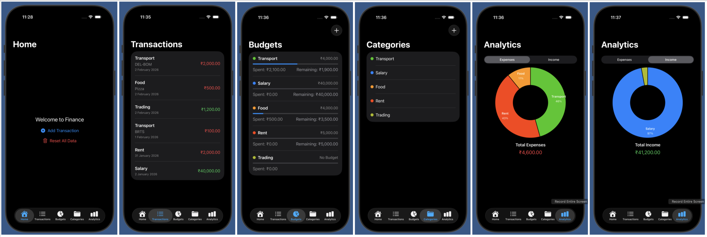

# Finance Manager

A lightweight, privacy‑focused personal finance tracker built with SwiftUI and SwiftData. Record transactions, organize them by category, set monthly budgets, and visualize spending with clear analytics.

## Features

- Quick entry for income and expenses with amount, date, category, and notes
- Customizable categories with color indicators
- Monthly budgets per category, with progress, remaining/over status, and swipe actions to edit or remove
- Transaction list with shareable summaries
- Analytics with a donut chart showing spending or income by category, with percentages and totals
- Sensible defaults on first launch (Food, Rent, Transport, Salary)
- Fully local data storage using SwiftData — your data stays on device

## Screens

  

- Home: Welcome and quick “Add Transaction” access
- Transactions: Chronological list with category, note, date, and amount
- Budgets: Set per‑category monthly budgets and see progress and remaining/over amounts
- Categories: Create and manage categories with color
- Analytics: Visual breakdown of expenses or income by category with totals

## Tech Stack

- SwiftUI for the UI and navigation
- SwiftData for on‑device persistence with model relationships
- Swift Charts for the analytics donut chart
- Modern Swift patterns (State, Query, NavigationStack, sheet presentations)

## How It Works

- Transactions: Each entry has an amount, date, note, type (expense/income), and optional category.
- Categories: Define your own categories and colors; default ones are seeded on first launch.
- Budgets: Assign a monthly budget per category; the app tracks how much you’ve spent this month and shows remaining/over.
- Analytics: Group transactions by category and visualize spending or income share and totals.

## Getting Started

1. Open the project in Xcode (iOS target).
2. Run on the iOS simulator or a device.
3. Use the “+ Add Transaction” button to start recording.
4. Set budgets from the Budgets tab; swipe a row to edit or remove.
5. Manage categories and explore analytics.

## Privacy

All data is stored locally on device using SwiftData. No accounts, no servers, no tracking.

## Roadmap Ideas

- Time‑range filters for budgets and analytics
- Multi‑currency support and currency settings
- Tags and advanced search
- Recurring transactions

## Contributing

Pull requests are welcome! For major changes, please open an issue first to discuss what you would like to change.
